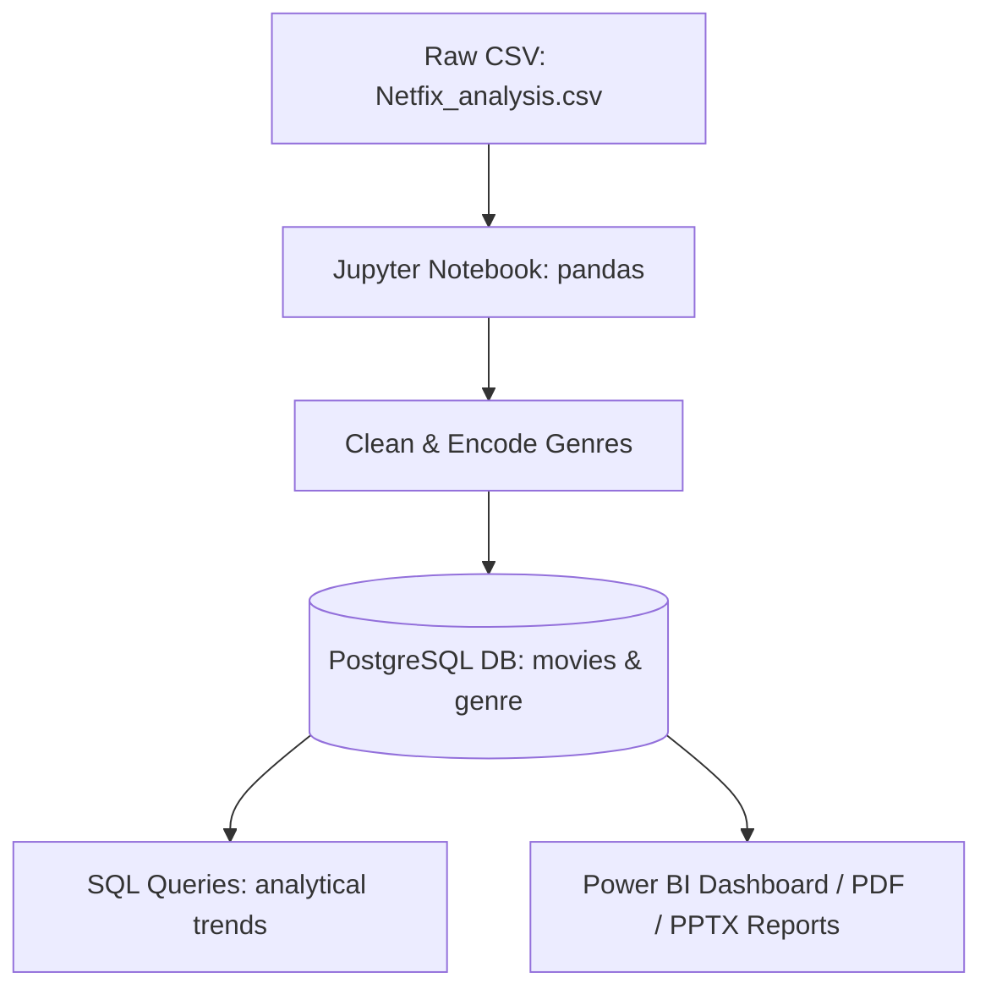

# Netfix Titles Analysis & Insights

[](https://www.python.org/)
[](https://www.postgresql.org/)
[](https://pandas.pydata.org/)
[](https://powerbi.microsoft.com/)

An end-to-end data engineering and analytics project focusing on the analysis of Netflix (Netfix) movies and TV shows. This repository houses the dataset, data cleaning pipelines, PostgreSQL schema definition, exploratory SQL queries, and visual reporting resources.

---

## Project Structure

This workspace is organized as follows:

*   **[dataset](file:///home/Ansh/data%20analisis/Netfix_Analysis/dataset)**: Contains the source dataset.
    *   [Netfix_analysis.csv](file:///home/Ansh/data%20analisis/Netfix_Analysis/dataset/Netfix_analysis.csv) - Raw metadata containing release dates, titles, genres, popularity scores, vote averages, and more.
*   **[Data_cleaning.ipynb](file:///home/Ansh/data%20analisis/Netfix_Analysis/Data_cleaning.ipynb)**: A Jupyter notebook outlining the Python/Pandas extraction, cleaning, preprocessing, and database schema ingestion pipeline.
*   **[SQL.sql](file:///home/Ansh/data%20analisis/Netfix_Analysis/SQL.sql)**: Structured SQL queries used to query database tables, perform analytical checks, and extract statistics.
*   **Visual Reports**:
    *   [Netfix_Analysis.pbix](file:///home/Ansh/data%20analisis/Netfix_Analysis/Netfix_Analysis.pbix) - Power BI Desktop workspace file featuring the interactive analysis dashboard.
    *   [Netfix_analysis.pdf.pdf](file:///home/Ansh/data%20analisis/Netfix_Analysis/Netfix_analysis.pdf.pdf) - Exported PDF report detailing analysis findings.
    *   [Netflix-Titles-Analysis-Report.pptx](file:///home/Ansh/data%20analisis/Netfix_Analysis/Netflix-Titles-Analysis-Report.pptx) - PowerPoint presentation explaining project insights and key takeaways.

---

## Data Pipeline & Architecture

The pipeline consists of three main phases: Data Ingestion & Cleaning, Database Storage & Querying, and Data Visualization.



### 1. Data Cleaning & Engineering (Python/Pandas)
In the Jupyter notebook [Data_cleaning.ipynb](file:///home/Ansh/data%20analisis/Netfix_Analysis/Data_cleaning.ipynb):
*   **Column Removal**: Irrelevant or heavy metadata fields like Overview and Poster_Url are dropped to streamline database performance.
*   **Genre Isolation & Encoding**: 19 unique genres were identified:
    *   *Action, Adventure, Animation, Comedy, Crime, Documentary, Drama, Family, Fantasy, History, Horror, Music, Mystery, Romance, Science Fiction, TV Movie, Thriller, War, Western.*
    *   For each genre, a binary column is dynamically created showing "Yes" or "No".
*   **Schema Normalization**:
    *   `movies` table: Contains metadata fields (`id`, `release_date`, `title`, `popularity`, `vote_count`, `vote_average`, `original_language`) and the 19 binary genre columns.
    *   `genre` table: Maintains the mapping of `index`, `title`, and original combined `genre` text to avoid duplication of main columns.
*   **PostgreSQL Export**: Data is loaded directly into the `Netfix_Analysis` database using SQLAlchemy's `create_engine` and `to_sql`.

### 2. SQL Analysis (PostgreSQL)
Various queries in [SQL.sql](file:///home/Ansh/data%20analisis/Netfix_Analysis/SQL.sql) extract business insights:
*   Identify top 5 most popular movies/shows.
*   Determine rating thresholds: Extracting "more liked" movies (popularity and rating both above dataset averages).
*   Temporal trends: Count movies released per year.
*   Language breakdowns: Filter average popularity and rating by original language (minimum 10 titles).
*   Genre classification filters.
*   Advanced rankings: CTEs with `ROW_NUMBER() OVER (PARTITION BY ...)` to locate the top 3 highest-rated movies per original language (minimum 5 titles).

### 3. Visual Reporting
*   **Power BI (`.pbix`)**: Used to construct dashboards showcasing title counts, popularity metrics, rating spreads, language representation, and genre trends.
*   **PDF/PPTX Reports**: Static versions of reports ready for business presentations and executives.

---

## How to Set Up & Run

### Prerequisites
*   **Python 3.8+** with the following packages:
    ```bash
    pip install pandas numpy sqlalchemy psycopg2-binary jupyter
    ```
*   **PostgreSQL** installed locally or hosted.
*   **Power BI Desktop** (to open `.pbix`).

### Ingestion Step
1. Start PostgreSQL and create a database named `Netfix_Analysis`.
2. Open the [Data_cleaning.ipynb](file:///home/Ansh/data%20analisis/Netfix_Analysis/Data_cleaning.ipynb) notebook.
3. Edit the PostgreSQL connections cell with your database credentials:
    ```python
    username = "postgres"      # Your PG Username
    password = "YOUR_PASSWORD" # Your PG Password
    host = "localhost"
    port = "5432"
    database = "Netfix_Analysis"
    ```
4. Run all cells in the Jupyter notebook. This will populate the `movies` and `genre` tables in your PostgreSQL database.

### Analytical Step
*   Connect to PostgreSQL using pgAdmin, DBeaver, or another SQL IDE.
*   Run the queries located in [SQL.sql](file:///home/Ansh/data%20analisis/Netfix_Analysis/SQL.sql) to analyze the dataset.
